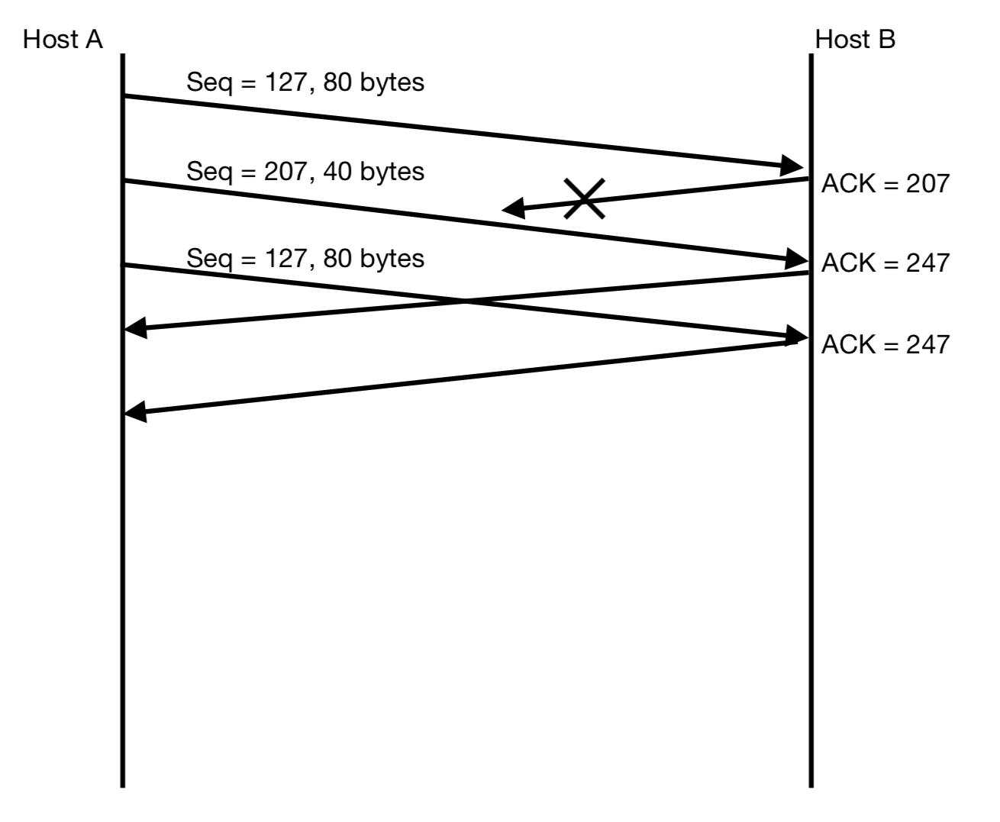

# Homework 4

1. UDP and TCP use 1's complement for their checksums. Suppose you are using 8-bit segments for the checksum mechanism and you have the following three 8-bit words: `00110011`, `01111110`, `10101010`.
   - What is the 1's complement sum of these words?
     - First we calculate the sum of 3 words, wrap around if overflow occurs
     - Sum: `01011100`
     - Complement Sum: `10100011`
   - Is it possible that a 1-bit error will go undetected? How about a 2-bit error?
     - 1-bit error will not undetected
     - 2-bit might undetected, if any 2 word occur bit flipping  at the same digit

2. Consider a channel that can lose packets but has a maximum delay that is known. Modify protocol `rdt2.1` to include sender timeout and retransmit. Informally argue why your protocol can communicate correctly over this channel.

    We need to add a timer at sender side, which the time limit is set as $RTT$ (or a little larger of $RTT$). If timeout, sender side retransmit the most recently transmitted packet.

    If the packet was lost, the sender will do retransmition. And if the packet was received but corrupted, or ACK was lost / corrupted, the sender also retransmit the packet to until a correct ACK was returned.

3. Consider the GBN protocol with a sender window size of $4$ and a sequence number range of $1024$. Suppose that at time $t$, the next in-order packet that the receiver is expecting has a sequence number of $k$. Assume that the medium does not reorder messages. Answer the following questions:

    - What are the possible sets of sequence numbers inside the sender's window at time $t$? Please justify your answer.
    
        Because at time $t%$ the receiver is expecting to receive packet $\text{Packet}_k$, means that $\text{ACK}_{k - 4}$ to $\text{ACK}_{k - 1}$ has already sent from receiver.
        
        Also $\text{Packet}_k$ to $\text{Packet}_{k + 3}$ maybe already sent from sender side (but we don't know the ACK was successfully transmit, loss or corrupt). 

        Therefore, the possible beginning of sequence numbers inside the sender's window is $[k - 4, k]$. If the beginning of sequence number is $i$, then the set of sequence numbers will be $[i, i + 3]$
    
    - What are all possible values of the ACK field in all possible messages currently propagating back to the sender at time $t$? Please justify your answer.

        Same as above, $\text{ACK}_{k - 4}$ to $\text{ACK}_{k - 1}$ has already sent from receiver. Additionally, the receiver maybe just received $\text{Packet}_{k - 1}$ at time $t$, maybe all of them is propagating.

4. Host A and B are communicating over a TCP connection, and Host B has already received from A all bytes up through byte 126. Suppose Host A then sends two segments to Host B back-to-back. The first and second segments contain 80 and 40 bytes of data, respectively. In the first segment, the sequence number is 127, the source port number is 302, and the destination port number is 80. Host B sends an acknowledgment whenever it receives a segment from Host A.

    - In the second segment sent from Host A to B, what are the sequence number, source port number, and destination port number?

        - Sequence Number: 207
        - Source port Number: 302
        - Destination port Number: 80

    - If the first segment arrives before the second segment, in the acknowledgment of the first arriving segment, what is the acknowledgment number, the source port number, and the destination port number?

        - ACK Number: 207
        - Source port Number: 80
        - Destination port Number: 302

    - If the second segment arrives before the first segment, in the acknowledgment of the first arriving segment, what is the acknowledgment number?

        - ACK Number: 127
        - Source port Number: 80
        - Destination port Number: 302

    - Suppose the two segments sent by A arrive in order at B. The first acknowledgment is lost and the second acknowledgment arrives after the first timeout interval. Draw a timing diagram, showing these segments and all other segments and acknowledgments sent. (Assume there is no additional packet loss.) For each segment in your figure, provide the sequence number and the number of bytes of data; for each acknowledgment that you add, provide the acknowledgment number.

        

5. Consider Figure 1. Assuming TCP Reno is the protocol experiencing the behavior shown above, answer the following questions. In all cases, you should provide a short discussion justifying your answer.
   
    - Identify the intervals of time when TCP slow start is operating.

        $[1, 6]$ and $[23, 26]$

    - Identify the intervals of time when TCP congestion avoidance is operating.

        $[6, 16]$ and $[17, 22]$

    - After the 16th transmission round, is segment loss detected by a triple duplicate ACK or by a timeout?

        Detected by a triple duplicate ACK

    - After the 22nd transmission round, is segment loss detected by a triple duplicate ACK or by a timeout?

        Detected by a timeout

    - What is the initial value of ssthresh at the first transmission round?

        Inital value of `ssthresh` at the first transmisison round is 32.

    - What is the value of `ssthresh` at the 18th transmission round?

        The value of `ssthresh` at 18th transmission round is 21.

    - What is the value of `ssthresh` at the 24th transmission round?

        The value of `ssthresh` at 24th transmission round is 14 (floor down of 14.5)

    - During what transmission round is the 70th segment sent?

        7th round. After 6th round, 63 segments were sent, and at 7th round, more 33 segments were sent. 

    - Assuming a packet loss is detected after the 26th round by the receipt of a triple duplicate ACK, what will be the values of the congestion window size and of ssthresh?

        `ssthresh` will set as 4, and the congestion window size will set as 7.

    - Suppose TCP Tahoe is used (instead of TCP Reno), and assume that triple duplicate ACKs are received at the 16th round. What are the ssthresh and the congestion window size at the 19th round?

        `ssthresh` is 21. and congestion window size is 1.
