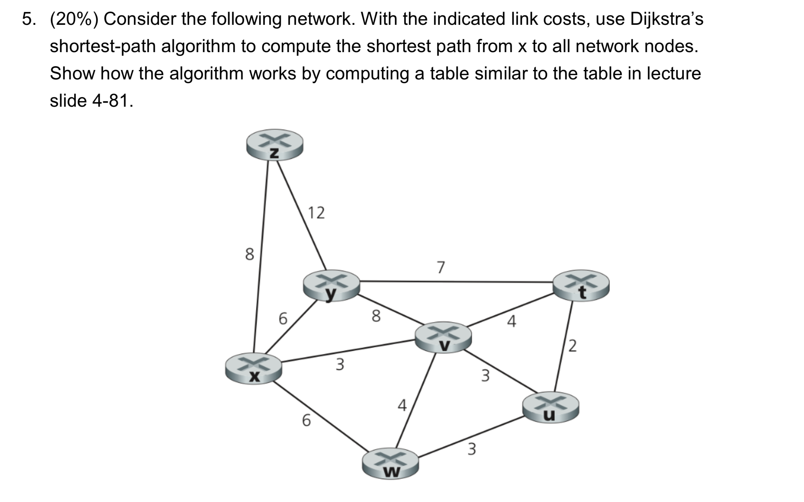
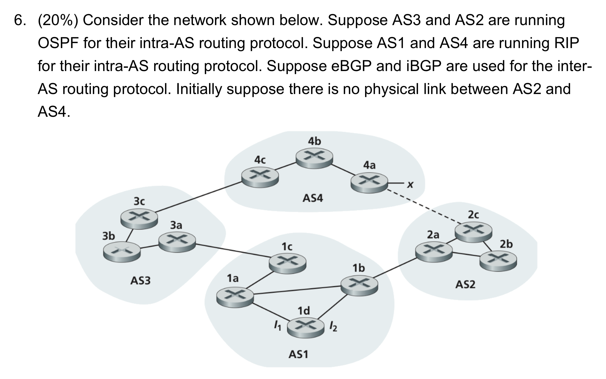

# Homework 5

1. (10%) What is the difference between routing and forwarding?

    Routing means choosing the path from source to destination. Forwarding means moving a packet from a router's input port to correct output port

2. (20%) Consider a virtual circuit (VC) network with a 2-bit field for the VC number. Suppose that the network wants to set up a virtual circuit over four links: link A, link B, link C, and link D. Suppose that each of these links is currently carrying two o ther virtual circuits, and the VC numbers of these other VCs are as follows:

    
    | Link A | Link B | Link C | Link D |
    | :----: | :----: | :----: | :----: |
    |   00   |   01   |   10   |   11   |
    |   01   |   10   |   11   |   00   |
    
    In answering the following questions, keep in mind that each of the existing VCs may only be traversing one of the four links.
    
    1. (10%) If each VC is required to use the same VC number on all links along its path, what VC number could be assigned to the new VC?

        0, there are no VC number can be assigned to new VC.

    2. (10%) If each VC is permitted to have different VC numbers in the different links along its path (so that forwarding tables must perform VC number translation), how many different combinations of four VC numbers (one for each of the four links) could be used?

        For each link has 2 VC numbers that are available, and total 4 links here. The number of different combinations of 4 VC numbers should be $2^4 = 16$

3. (20%) Consider a datagram network using 32-bit host addresses. Suppose a router has four links, numbered 0 through 3, and packets are to be forwarded to the link interfaces as follows:

    | Destination Address Range             | Link interface |
    | ------------------------------------- | :------------: |
    | `11100000 00000000 00000000 00000000` |                |
    | through                               |       0        |
    | `11100000 00111111 11111111 11111111` |                |
    |                                       |                |
    | `11100000 01000000 00000000 00000000` |                |
    | through                               |       1        |
    | `11100000 01000000 11111111 11111111` |                |
    |                                       |                |
    | `11100000 01000001 00000000 00000000` |                |
    | through                               |       2        |
    | `11100001 01111111 11111111 11111111` |                |
    |                                       |                |
    | otherwise                             |       3        |

    1. (10%) Provide a forwarding table that has four entries, uses longest prefix matching, and forwards packets to the correct link interfaces.

        | Prefix              | Link interface |
        | ------------------- | :------------: |
        | `11100000 00`       |       0        |
        | `11100000 01000000` |       1        |
        | `1110000`           |       2        |
        | `11100001 1`        |       3        |
        | otherwise           |       3        |

    2. (10%) Describe how your forwarding table determines the appropriate linkinterface for datagrams with destination addresses:

        | Destination Address                   | Interface |
        | ------------------------------------- | :-------: |
        | `11001000 10010001 01010001 01010101` |     3     |
        | `11100001 01000000 11000011 00111100` |     2     |
        | `11100001 10000000 00010001 01110111` |     3     |

4. (10%) Consider a subnet with prefix 128.119.40.128/26.

    (`128.119.40.128` to `128.119.40.191`)

    1. (5%) Give an example of one IP address (of form xxx.xxx.xxx.xxx) that can be assigned to this network.

        `128.119.40.129`

    2. (5%) Suppose an ISP owns the block of addresses of the form 128.119.40.64/25. Suppose it wants to create four subnets from this block, with each block having the same number of IP addresses. What are the prefixes (of form a.b.c.d/x) for the four subnets?

        (128 addresses - 64 addresses) / 4 subnets = 16 addresses / subnet

        mask = 4 bits

        - `128.119.40.64/28` 
        - `128.119.40.80/28` 
        - `128.119.40.96/28` 
        - `128.119.40.112/28`

5. (20%) Consider the following network. With the indicated link costs, use Dijkstra’s shortest-path algorithm to compute the shortest path from x to all network nodes. Show how the algorithm works by computing a table similar to the table in lecture slide 4-81.

    

    | Step | N'      | D(t), p(t) | D(u), p(u) | D(v), p(v) | D(w), p(w) | D(y), p(y) | D(z), p(z) |
    | ---- | ------- | :--------: | :--------: | :--------: | :--------: | :--------: | :--------: |
    | 0    | x       |   $\inf$   |   $\inf$   |    3, x    |    6, x    |    6, x    |    8, x    |
    | 1    | xv      |    7, v    |    6, v    |    3, x    |    6, x    |    6, x    |    8, x    |
    | 2    | xvu     |    7, v    |    6, v    |    3, x    |    6, x    |    6, x    |    8, x    |
    | 3    | xvuw    |    7, v    |    6, v    |    3, x    |    6, x    |    6, x    |    8, x    |
    | 4    | xvuwy   |    7, v    |    6, v    |    3, x    |    6, x    |    6, x    |    8, x    |
    | 5    | xvuwyt  |    7, v    |    6, v    |    3, x    |    6, x    |    6, x    |    8, x    |
    | 6    | xvuwytz |    7, v    |    6, v    |    3, x    |    6, x    |    6, x    |    8, x    |

6. (20%) Consider the network shown below. Suppose AS3 and AS2 are running OSPF for their intra-AS routing protocol. Suppose AS1 and AS4 are running RIP for their intra-AS routing protocol. Suppose eBGP and iBGP are used for the inter- AS routing protocol. Initially suppose there is no physical link between AS2 and AS4.
    
    
    
    1. (5%) Router 3c learns about prefix x from which routing protocol: OSPF, RIP, eBGP, or iBGP?

        eBGP

    2. (5%) Router 3a learns about x from which routing protocol?
    
        iBGP

    3. (5%) Router 1c learns about x from which routing protocol? 
    
        eBGP

    4. (5%) Router 1d learns about x from which routing protocol?

        iBGP

7. (15%)
    1. (5%) What is the size of the multicast address space?

        There are fixed 4 bits for multicast address, so the size of the multicast address space is $2 ^ {28}$

    2. (5%) Suppose now that two multicast groups randomly choose a multicast address. What is the probability that they choose the same address
    
        $$\text{Prob} = \frac{1}{N}$$

    3. (5%) Suppose now that 1,000 multicast groups are ongoing at the same time and choose their multicast group addresses at random. What is the probability that they interfere with each other?

        $$\text{Prob} = 1 - \prod_{i=0}^{999} \frac{N-i}{N}$$