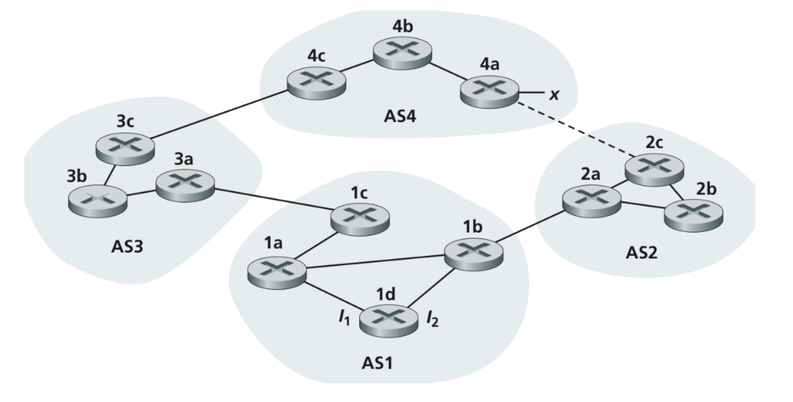
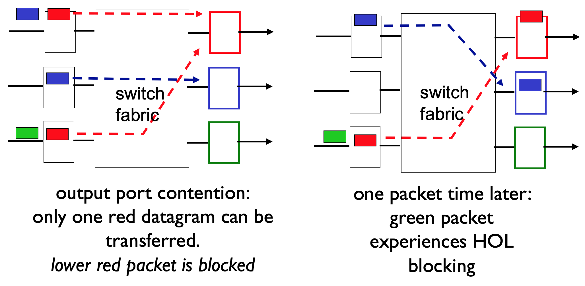

# Homework 6

1. (20%) What is the difference between routing and forwarding?

    Routing means choosing the path from source to destination. Forwarding means moving a packet from a router's input port to correct output port

2. (30%) Consider the network shown below. Suppose AS3 and AS2 are running OSPF for their intra-AS routing protocol. Suppose AS1 and AS4 are running RIP for their intra-AS routing protocol. Suppose eBGP and iBGP are used for the inter- AS routing protocol. Initially suppose there is no physical link between AS2 and AS4.

    

    1. Router 3c learns about prefix X from which routing protocol?
    
        eBGP
    
    2. Router 3a learns about X from which routing protocol?
    
        iBGP

    3. Router 1c learns about X from which routing protocol?

        eBGP

3. (20%)
    
    1. What is the Head‐of‐the‐Line (HOL) blocking?

        In the figure below, we know that the destination of second packet in the 3-rd queue is the last port, but the first packet in that queue was not allow to forwarding because of the first packet at 1-st queue. Although the last port was free, the packet can't forward until the head of the queue was forwarded, we say this situraition Head-of-the-Line blocking

    2. Draw a figure to show it.

        

        The figure is captured from Chapter 4 of Lecture PPT.